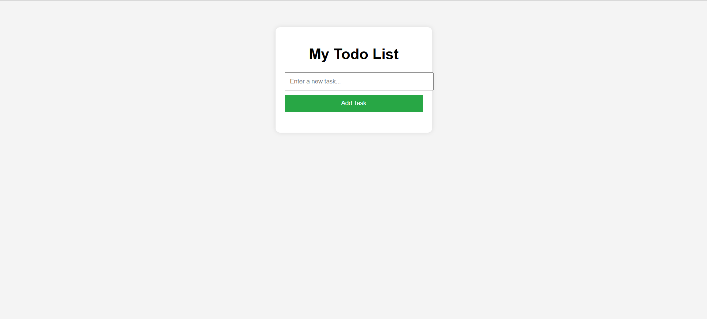

# 📝 Todo List Application (TypeScript Version)

A simple, web-based Todo List app built using **HTML**, **CSS**, and **TypeScript** (compiled to JavaScript). This app allows users to add, edit, and delete tasks interactively.

---

## 🔧 Features

- ➕ Add new tasks
- ✏️ Edit existing tasks
- ❌ Delete tasks
- 🧠 Built with TypeScript for better code safety and maintainability

---

## 🚀 Getting Started

### Requirements

- A modern web browser (Chrome, Firefox, etc.)
- Node.js & TypeScript compiler (for development)

### Instructions

1. Clone or download this repository.
2. Compile the TypeScript file:
   ```bash
   tsc script.ts
This will generate a script.js file.

3. Open the index.html file in your browser.
4. Start managing your tasks!


## 📁 Project Structure

todo-ts-app/
├── index.html 
├── style.css 
├── script.ts 
├── script.js # Compiled JavaScript file
└── README.md

🧠 Concepts Used
    - TypeScript interfaces & types
    - DOM manipulation
    - Event handling
    - JavaScript arrays and objects
    - Functional UI rendering

📸 Screenshot
    

📄 License
    - This project is licensed under the MIT License — feel free to use, modify, and distribute.

🙌 Acknowledgment
    - This app was created as a beginner-friendly project to demonstrate core TypeScript and DOM skills.
